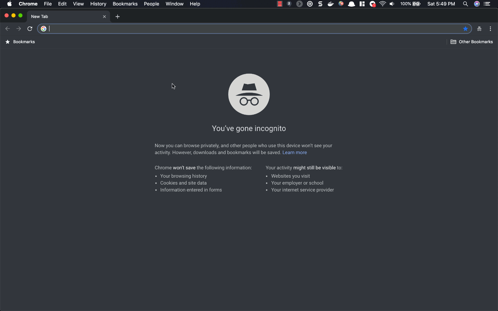

# Demonstration Application for VMware Cloud Automation Services (CAS)

Multi-tier application (3), responsive, and leverages technologies and languages that are common place in developer communities. It was designed as cloud native first from a Docker perspective (included is the docker compose file) but also includes the Kubernetes YAML file for deploying to a Kubernetes cluster.

A blueprint.yaml file for import into Cloud Automation Services is included as well.

## Application Description 

# Tier 1 - Frontend Application - User Presentation 

* Angular 7 front end with VMware ClarityUI (https://vmware.github.io/clarity/)
* NGINX hosting Angular app and also providing reverse proxy functionality to the App Tier. Reason for this is since Angular is a client side extension, connecting to the app directly causes it to fail since it can't resolve DNS
* Messaging Application leverages Sockets.IO to open a Socket channel between the client and server for rapid updates
* API Demo Interacts with the Cloud Automation Services API's to return information/details around a given CAS Org (leveraging the CSP refresh Token)

# Tier 2 - App Tier - API 

* Python Flask based application
* Handles interaction between the Frontend and Database tier, the Frontend and the websocket interaction, as well as the frontend to CAS API interaction
* Scalable to N number of pods 
* Needs to be instantiated BEFORE the Frontend

# Tier 3 - DB Tier - Data 

* Postgresql 10 database (named 'posts')
* Precreated table (named 'textData') 
* Do not scale this pod; bad things will happen

## Todo's

* Merge flask routes into 1 route instead of 2 (RESTful Model) 

